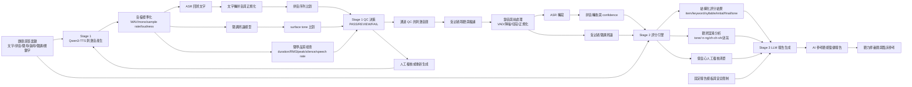

# 華語聽能複誦 AI 輔助分析系統架構

## 研究定位

本系統不是直接取代臨床聽力評估，而是建立一套可驗證的華語聽能複誦 AI 輔助流程。系統核心目標為：

1. 驗證 TTS 產生的華語聽測刺激音是否符合測驗需求。
2. 將受試者複誦語音轉換為可量化的音節、聲母、韻母與聲調層級指標。
3. 根據結構化錯誤分析，產生模板化的參考聽能復健報告。

## 核心資料基準：題庫與答案鍵

所有階段都應以同一份題庫與答案鍵為基準。建議每題至少包含：

- item_id
- 中文目標詞或句
- 拼音序列
- 聲母序列
- 韻母序列
- 字典聲調 lexical tone
- 實際預期聲調 surface tone
- 關鍵字標記
- 題目難度或類別
- 預期音檔長度範圍

範例：

```json
{
  "item_id": "W001",
  "text": "青菜",
  "pinyin": ["qing1", "cai4"],
  "syllables": ["qing", "cai"],
  "initials": ["q", "c"],
  "finals": ["ing", "ai"],
  "lexical_tones": [1, 4],
  "surface_tones": [1, 4],
  "keywords": ["青菜"],
  "expected_duration_sec": [0.8, 1.8]
}
```

## Stage 1：TTS 刺激音自動品質檢驗

### 目的

確認 Qwen3-TTS 產生的音檔在內容、聲調與聲學品質上可作為正式聽測刺激音。

### 流程

1. Qwen3-TTS 根據題庫產生音檔。
2. 音檔標準化為固定格式，例如 WAV、mono、16 kHz 或 24 kHz。
3. ASR 將 TTS 音檔回辨為文字。
4. ASR 文字轉為拼音序列，避免同音字造成中文字比對誤判。
5. 拼音序列與答案鍵比對。
6. 聲調辨識模型判斷音節聲調，與 surface tone 比對。
7. 聲學 QC 規則檢查：音量、峰值、削波、靜音、時長、語速。
8. 產生 PASS / REVIEW / FAIL 判定。
9. REVIEW 或 FAIL 音檔進入人工複核或重新生成。

### 建議檢查指標

| 類別 | 指標 | 用途 |
|---|---|---|
| 內容一致性 | ASR-to-pinyin match | 確認 TTS 是否念出正確音節 |
| 聲調一致性 | tone accuracy, tone confidence | 確認華語聲調是否符合答案鍵 |
| 音檔規格 | sample rate, channel, format | 確認檔案格式一致 |
| 音量品質 | RMS/LUFS, peak dBFS | 避免過小聲、過大聲或爆音 |
| 時間品質 | duration, leading/trailing silence | 避免截斷或靜音過長 |
| 語速 | syllables per second | 避免刺激音過快或過慢 |

### 聲學品質檢查這塊怎麼做

這一塊不是在判斷答案對不對，而是在判斷這個 TTS 音檔能不能拿來當正式刺激音。最小可行版本可以先做成 rule-based QC，拆成四個步驟：

1. 規格檢查：sample rate、channel、format、bit depth 是否符合統一規格。
2. 聲學量測：計算 duration、leading silence、trailing silence、RMS 或 LUFS、peak dBFS、clipping ratio。
3. 語速估計：用答案鍵的 syllable 數量除以有效語音時長，得到 syllables per second。
4. 規則判定：根據門檻輸出 PASS / REVIEW / FAIL 與原因。

建議這個模組至少輸出下列欄位：

- item_id
- duration_sec
- leading_silence_ms
- trailing_silence_ms
- rms_dbfs 或 lufs
- peak_dbfs
- clipped_samples
- speech_rate_syllable_per_sec
- qc_status
- qc_reasons

判定邏輯可以先這樣落地：

- PASS：所有 hard rules 都通過。
- REVIEW：接近門檻，或只有 soft rule 異常，例如音量稍低、尾端靜音稍長。
- FAIL：格式錯誤、嚴重 clipping、截斷、靜音過長或語速明顯不合理。

實作時可先拆成 `load_audio -> extract_metrics -> apply_rules -> write_qc_report` 四個函式。先把 rule-based 流程跑穩，再決定是否引入更細的聲學模型。

### Stage 1 輸出

- approved_stimuli 音檔庫
- TTS QC report
- 每題 PASS / REVIEW / FAIL
- 需人工複核清單

## Stage 2：ASR + 聲調辨識自動複誦評分

### 目的

將受試者的複誦語音轉換為可量化的聽辨表現指標，並標示可能的聽辨混淆型態。

### 流程

1. 受試者聆聽 Stage 1 通過 QC 的刺激音。
2. 系統錄製受試者複誦反應。
3. 錄音前處理：VAD、降噪、音量正規化、切段。
4. ASR 輸出文字與 confidence。
5. ASR 文字轉為拼音序列。
6. 聲調辨識模型分析受試者每個音節的聲調。
7. 評分引擎與答案鍵比對。
8. 產生整體分數、音韻層級分數與錯誤類型。
9. 低信心或不一致個案標記為人工複核。

### 建議評分維度

- item accuracy
- keyword accuracy
- syllable accuracy
- initial accuracy
- final accuracy
- tone accuracy
- ASR confidence
- low-confidence review rate
- confusion matrix

### 錯誤分類範例

- 聲調聽辨混淆：例如 2 聲 / 3 聲
- 鼻音韻尾混淆：例如 -n / -ng
- 聲母混淆：例如 zh/ch/sh 與 j/q/x
- 送氣與不送氣混淆
- ASR 低信心，需人工複核

### Stage 2 輸出

- structured_score.json
- item_level_results.csv
- confusion_summary.json
- human_review_items.csv

補充：Stage 1 的「通過 QC 的刺激音庫」是 Stage 2 的播放輸入，也就是受試者要聽的正式刺激音。它不會直接產生「聽辨混淆分析」；混淆分析一定要來自受試者反應與答案鍵比對。

## Stage 3：LLM 參考復健報告生成

### 目的

LLM 不直接診斷，也不直接從原始音檔自行推論臨床結論。LLM 的角色是根據 Stage 2 的結構化結果，依固定模板產生參考報告。

### 輸入

- 受試者基本測驗資訊
- Stage 2 結構化分數
- 錯誤與混淆型態摘要
- 低信心或需人工複核項目
- 報告模板
- 安全限制語句

### 輸出報告章節

1. 測驗資訊
2. 整體表現摘要
3. 主要聽辨混淆型態
4. 低信心與人工複核建議
5. 參考聽能訓練建議
6. 限制聲明

### 報告限制語句

報告應明確標示為參考用途，結果可能受到注意力、記憶、口語輸出、錄音品質、ASR 錯誤與模型不確定性影響，不能單獨作為臨床診斷依據。

## 驗證設計

### Stage 1 驗證

- 人工聽檢 TTS 音檔作為參考。
- 比較自動 QC 與人工判定一致率。
- 統計 PASS / REVIEW / FAIL 分布。
- 分析 TTS 常見錯誤類型。

### Stage 2 驗證

- 由兩位聽力師獨立評分。
- 不一致項目由第三位專家或共識會議裁決。
- AI 評分與人工共識評分比較。
- 指標可包含 accuracy、Cohen's kappa、weighted kappa、ICC、confusion matrix。

### Stage 3 驗證

- 評估報告是否符合模板。
- 評估報告是否忠實反映 Stage 2 結果。
- 由專家評估可讀性、臨床參考性與是否有過度診斷語句。

## 系統資料流 Mermaid 圖


